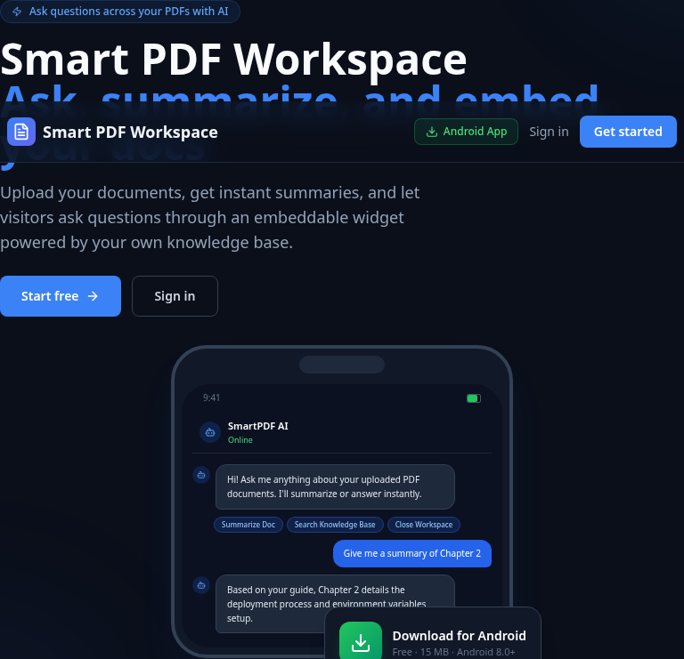

# Smart PDF Workspace

Multi-tenant workspace to upload PDFs, ask AI questions about them (with sources), generate summaries, and publish an embeddable ask-your-docs widget — built exactly like [AI Virtual Receptionist](https://github.com/djoudad292/ai-virtual-receptionist).

**Live demo:** [docs.djaouad.tech](https://docs.djaouad.tech)



## Architecture

| Part | Stack | Host |
|---|---|---|
| `backend/` | NestJS 10, Postgres + pgvector, OpenRouter LLM, OpenAI embeddings | Render |
| `frontend/` | Next.js 14 (static export), Tailwind, auth + dashboard | Vercel / Netlify |
| `mobile/` | Expo SDK 54 (Android APK via EAS) | EAS |
| `widget/` | Vanilla JS ask-your-docs snippet, bundled with esbuild → `frontend/public/widget.js` | CDN / static |

## Features

- **Multi-tenant auth** — JWT access + refresh with token revocation, company slugs, agent invites, forgot/reset password.
- **Upload PDFs** — stored as `BYTEA` in Postgres; text extracted with `pdf-parse`, chunked, and embedded into `vector(1536)` rows with pgvector similarity search.
- **Ask your documents** — RAG answers grounded in your PDFs with similarity sources shown.
- **Summaries** — one-click AI summaries, cached per document.
- **Ask-your-docs widget** — one-line embeddable script; config (title, color, position) editable per workspace.
- **Mobile app** — auth, upload, ask, summaries, widget settings on Android/iOS.

## Quick start

```bash
# Backend
cd backend
cp .env.example .env   # set DATABASE_URL etc.
npm install && npm run start:dev

# Frontend
cd frontend
npm install && npm run dev   # set NEXT_PUBLIC_API_URL

# Widget
cd widget && npm install && npm run build   # → frontend/public/widget.js

# Mobile
cd mobile
cp .env.example .env   # set EXPO_PUBLIC_API_URL
npm install && npm start
```

## Environment variables

- `backend/.env.example` — `DATABASE_URL`, `JWT_SECRET`, `JWT_REFRESH_SECRET`, optional `OPENAI_API_KEY`, `OPENROUTER_API_KEY`, `OPENROUTER_MODEL`, `SMTP_*`, `FRONTEND_URL`, `APP_URL`.
- `frontend/.env.example` — `NEXT_PUBLIC_API_URL`, `NEXT_PUBLIC_WIDGET_URL`.
- `mobile/.env.example` — `EXPO_PUBLIC_API_URL`.

> Note: without `OPENAI_API_KEY` the app uses a deterministic local-hash embedding fallback (1536-dim). Without `OPENROUTER_API_KEY`, ask/summarize return a helpful "no answer" fallback.

## Deploy

Repo ships ready-made configs: `render.yaml` (backend), `netlify.toml` (frontend), `.github/workflows/eas-build.yml` (mobile).

- **Backend (Render):** live at `https://smart-pdf-backend-vyh7.onrender.com` (deployed from `render.yaml` blueprint; `smart-pdf-backend` service, root dir `backend`, build `npm ci && npm run build`, start `node dist/main`). Schema auto-creates on boot. Set the `sync: false` env vars (`DATABASE_URL`, `OPENROUTER_API_KEY`, `OPENAI_API_KEY`, `JWT_SECRET`, `JWT_REFRESH_SECRET`, optional `SMTP_*`) in the Render dashboard.
- **DB:** any Postgres with the `vector` extension (this deployment uses Neon, database `smartpdf`).
- **Frontend (Netlify):** live at `https://docs.djaouad.tech` (site `smart-pdf-docs`, built from `frontend/` and published `out/`). `netlify.toml` + `.github/workflows/netlify-deploy.yml` deploy automatically on every push touching `frontend/`, `widget/`, or `netlify.toml`.
- **Widget:** built to `frontend/public/widget.js`, served at `https://docs.djaouad.tech/widget.js`.
- **Mobile (EAS):** `.github/workflows/eas-build.yml` builds a preview APK on every push touching `mobile/`. First-time setup: add an `EXPO_TOKEN` secret to the repo, run `cd mobile && npx eas init` once, and replace the `REPLACE_WITH_EAS_PROJECT_ID` placeholder in `app.json`.

## Widget embed

```html
<script src="https://docs.djaouad.tech/widget.js" data-company-id="YOUR_COMPANY_ID"></script>
```

Requires at least one document published in the dashboard.

## CI

`.github/workflows/ci.yml` builds and tests the backend, typechecks + builds the frontend, typechecks the mobile app, and bundles the widget.

Demo by [djaouad.tech](https://djaouad.tech) — Built by [djaouad frih](https://djaouad.tech).
